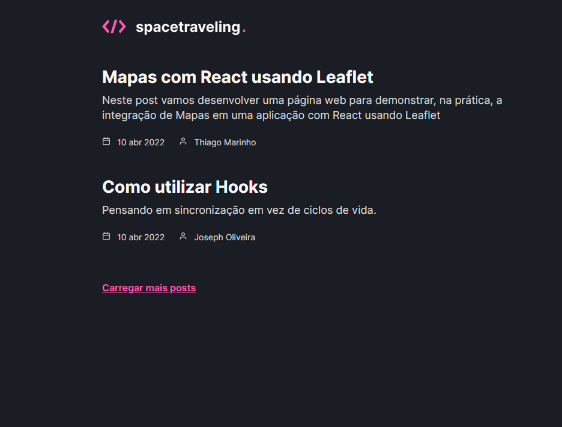

<div>
  <p>
    
  </p>

# 📖 Sobre o projeto

O spacetraveling é um desafio da Rocketseat[ignite].

Spacetraveling foi construindo usando tecnlogias que aprendemos na trilha de ReactJs do ignite capítulo 3.

O desafio consiste em criar um blog do 0 usando Prismic CMS usando um layout do Figma que eles nos disponibilizaram

  <p style="margin-top: 15px;">
    
  </p>
</div>

# 🚀 Tecnologias

Nós usamos essas tecnlogias para desenvolver o projeto:

- NextJS
- Prismic CMS
- Sass
- React Icons

# 💻 Como usar ?

Primeiro vamos clonar o repositório

```bash
# Abra o terminal e copie o código abaixo:
$ git clone https://github.com/Guilherme-Santos08/spacetraveling.git

# Entre na pasta
cd spacetraveling

# Instalar as dependências
$ yarn

# Iniciar o projeto
$ yarn dev
```

O site estará disponível em http://localhost:3000.
